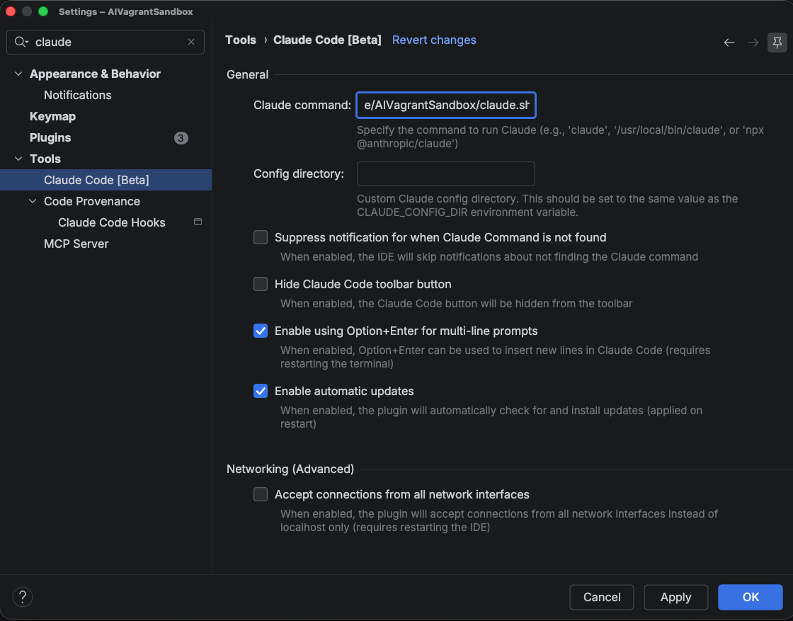
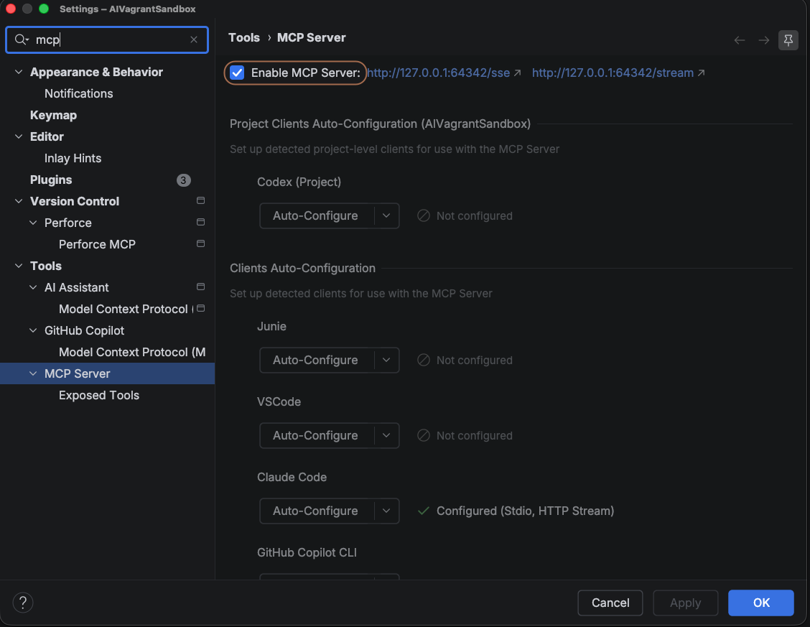

An example AI agent sandbox built with Vagrant.

The `claude.sh` script is expected to be called by the IDE when launching Claude Code.

> [!WARNING]
> The port that the IntelliJ MCP server listens on is unsique to each host. The port in `claude.sh` or `claude.ps1` must be updated to match the port that the MCP server is listening on.

In InteliJ IDEA and other JetBrains IDEs, you can configure the script to be called by navigating to Tools > Claude Code > Claude Command.

Enable the MCP server by navigating to Tools > MCP Server.

